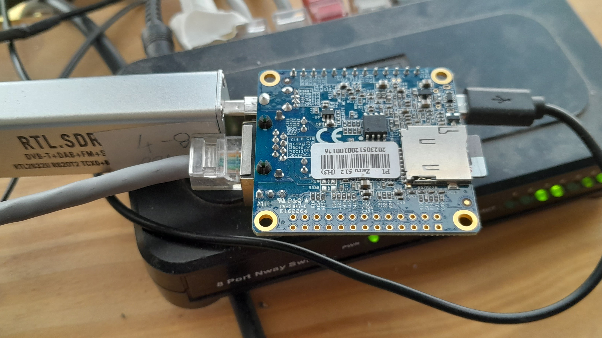

# Sailing Vessel Shaka

# May 2021 Radar and AIS Install

## Big Picture
### Broken Radar Replace
Old Raymarine from previous boat worked for a few months and then failed.
### Install AIS RX
Just need a simple low cost solution for receive only AIS.

## Background Notes on Radar
Raymarine DSM300 are known to fail...Sometimes you can open it up and find a bad soldering connection...
The DSM's made in Mexico were known to have a high failure rate and voltage sensitivity issues. Raymarine extended the warranty and replaced them with ones that were made in Hungary.
